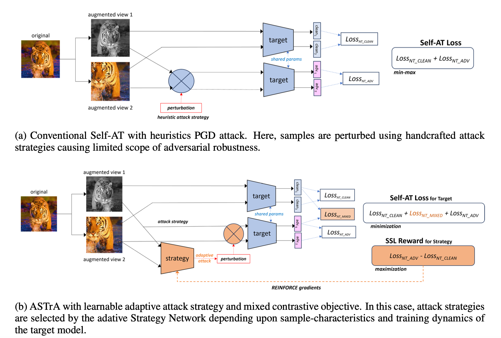

# ASTrA---Adversarial-Self-Supervised-Training-with-Adaptive-Attacks
This repo contains the work our ICLR submission 2025 titled "ASTRA: ADVERSARIAL SELF-SUPERVISED TRAINING WITH ADAPTIVE-ATTACKS"

Install the requisite conda environment using ASTra_environment.yml
## Training 
To run the code:
Run it using the bash file
bash run.sh 
run.sh file has all the hyperparameters tuned accordingly

## Evaluation

### SLF & ALF

    python test_LF.py --experiment EXP_PATH --checkpoint PATH_TO_PRETRAINED_MODEL --dataset DATASET_NAME --data PATH_TO_DATASET --cvt_state_dict --bnNameCnt 1 --evaluation_mode EVALUATION_MODE

### AFF

    python test_AFF.py --experiment EXP_PATH --checkpoint PATH_TO_PRETRAINED_MODEL --dataset DATASET_NAME --data PATH_TO_DATASET

## Acknowledgements

Some of our code are borrowed from [DynACL](https://github.com/PKU-ML/DYNACL/). Thanks for their great work!